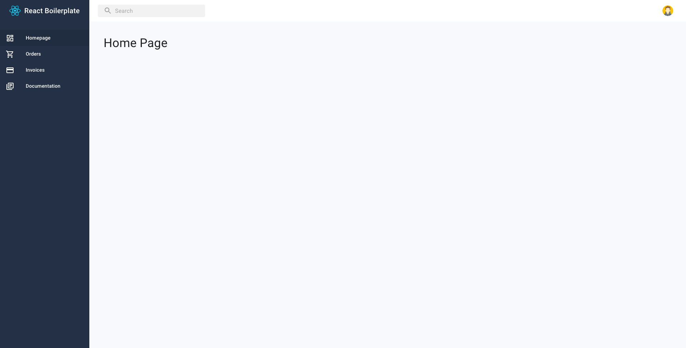

# React Next Material UI Boilerplate

This project serves as a boilerplate for front-end web projects.

It contains a fully functional React web application, using the NextJS, Material UI, Firebase and other libraries, with several views:

- A login screen for user authentication
- A dashboard
- A simple user setting form




With this starter kit, you get:

- Routing
- Authentication
- Forms with validation
- Networking
- Coding guidelines enforced via prettier, linting & typescript
- Examples for unit and integration testing

## Getting Started

1. Install dependencies:

```
yarn
```

2. Run the development server:
```
yarn dev
```

3. Build project:
```
yarn build
```

4. Run the production server:
```
yarn start
```

## Frontend Stack

- Language: Typescript
- UI: React, NextJS, Material UI
- Form: Formik
- State management: Redux, Redux Thunk
- Utilities: Lodash, Moment
- Network: Axios
- Testing: Jest, Enzyme
- Codestyle: Prettier, ESLint

## Folder Structure

```
┣ 📂 pages
┣ 📂 public
┣ 📂 scripts
┗ 📂 src
  ┣ 📂 apis
  ┣ 📂 enums
  ┣ 📂 helpers
  ┣ 📂 hooks
  ┣ 📂 i18n
  ┣ 📂 redux
  ┣ 📂 services
  ┣ 📂 styles
  ┣ 📂 types
  ┗ 📂 views
    ┣ 📂 components
    ┣ 📂 homepage
    ┃ ...
    ┣ 📄 _app.tsx
    ┗ 📄 _document.tsx
```

## Typescript

Typescript should be closely adhered to for static type-checking.

**Rules:**

- Do not use `any` unless it is expected to accept any types; else it defeats the purpose of using Typescript

## NextJS

The Next.js is React Based framework with server side rendering capability.

```
┣ 📂 pages
┃ ┣ 📂 api
┃ ┣ 📂 sign-in
┃ ┃ ┗ 📄 index.tsx
┃ ┃ ...
┃ ┣ 📄 _app.tsx
┃ ┣ 📄 _document.tsx
┃ ┗ 📄 index.tsx
┣ 📂 src
┃ ┗ 📂 views
┃   ┣ 📂 homepage
┃   ┣ 📂 sign-in
┃   ┃ ...
┃   ┣ 📄 _app.tsx
┃   ┗ 📄 _document.tsx
┗ 📄 next.config.js
```

- Use pages directory structure to define route system.
- `_app.tsx` - Control page initialization.
- `_document.tsx` - Used to augment your application's <html> and <body> tags.
- `next.config.js` - Custom advanced behavior of Next.js

**Rules:**

- Pages directory is only used for routing. Do not use for logic implementation.


## Redux

Redux consists of actions, reducers and selectors.

### Redux configuration

```
┗ 📂 src
  ┗ 📂 redux
    ┣ 📄 configure-store.ts
    ┣ 📄 type-redux.ts
    ┗ 📄 with-redux.tsx
```

- `configure-store.ts` - Store configuration
- `type-redux.ts` - Async utilities library for Redux
- `with-redux.tsx` - Support SSR

### Actions

```
┗ 📂 src
  ┗ 📂 redux
    ┗ 📂 actions
      ┗ 📄 app.action.ts
```

- There are 2 type of actions: sync and async action.
- Use `createTypeAction` to create sync action.
- Use `createTypeAsyncAction` to create sync action.

### Reducers

```
┗ 📂 src
  ┗ 📂 redux
    ┗ 📂 reducers
      ┗ 📄 app.reducer.ts
```

- Reducers store API response as global state.
- Use `createTypeReducer` to create reducer with type.

### Selectors

```
┗ 📂 src
  ┗ 📂 redux
    ┗ 📂 selectors
      ┗ 📄 app.selector.ts
```

- Group global state mapping to reuse in many places in views.

**Rules:**

- Do not use complex transformation in selector.

## Views

- `views/components` directory stores reuse components.
- `views/pages/*` directory stores next pages & inner components.

### Components

```
┗ 📂 src
  ┗ 📂 views
    ┗ 📂 components
      ┗ 📂 layout
        ┣ 📄 index.tsx
        ┣ 📄 style.ts
        ┗ 📄 form.ts
```

- `index.tsx` - React component.
- `style.ts` - Style configuration (material ui style system).
- `form.tsx` - Form configuration (formik).

**Rules:**

- Recommend use react function component.
- Component style should be in a separate file `styles.ts`.
- All components should have brief documentation on their main functions.

## Style - Theme

[Material UI](https://material-ui.com/) is the main framework for styling and theming.

```
┗ 📂 src
  ┗ 📂 styles
    ┣ 📄 breakpoints.ts
    ┣ 📄 colors.ts
    ┣ 📄 common.ts
    ┗ 📄 theme.ts
```

- `breakpoints.ts` - Screen breakpoints to support responsive.
- `colors.ts` - Color definitions.
- `common.ts` - Common styles.
- `theme.ts` - Theme customization, that contains all the configurations for styling including colors, typography and fonts.

**Rules**

- Do not hardcode any color in component styles. Use only the colors set in `theme.ts`.
- Do not hardcode spacing for `margin`, `padding`, etc. Use `theme.spacing(16)` which translates to 16px.
- Use configurations from `theme.ts` as much as possible for ease of standardization and better consistencies.

## Localization

Use [Next-i18next](https://github.com/isaachinman/next-i18next) to support localization.

```
┣ 📂 public
┃ ┗ 📂 static
┃   ┗ 📂 locales
┃     ┗ 📂 en
┃     ┃ ┗ 📄 common.json
┃     ┗ 📂 ja
┃       ┗ 📄 common.json
┗ 📂 src
  ┗ 📂 i18n
    ┣ 📄 index.ts
    ┗ 📄 ns.ts
```

- `public/static/locals` directory stores localiztion configuations.
- `src/i18n/index.ts` next-i18next configuration.
- `src/i18n/ns.ts` file stores namespace.

## Types

Declare types for proper type-checking.

```
┗ 📂 src
  ┗ 📂 types
```

## Enums

Use enums to avoid hard-coding and increase code re-usability.

```
┗ 📂 src
  ┗ 📂 enums
```

**Rules**

- All enums must only be stored in this folder.
- All enums naming should end with `Enum` to prevent having exporting the same name as types.
- All enums should be exported individually.

## Lint

ESLint is the main framework for linting.

**Rules**

- `.eslintrc.js` should not be overwritten to exclude new rules
- For lint edge cases, include `eslint-ignore` for particular line or file.

## Testing

Jest and EnzymeJS is the main framework for testing.

- Testing should cover all aspects of the code, but should be approached differently according to what is being tested. This can generally be split into three categories - UI, application logic and utilities.
- Use [Jest](https://jestjs.io/) for test running, mocking, and all other testing requirements.
- Use [`EnzymeJS`](https://enzymejs.github.io/enzyme/) to test UI.
- Testing should fit around implementation, not the other way around. The way the application works should not change in order to fit unit tests.
- If implementation logic is heavy, extract logic into separate functions/files and test those separately.

### Redux Test

- Action and reducer tests must have 100% coverage.
- It helps to ensure that actions and reducer states are properly defined and controlled which reduce side effects at component state.

### Component Test

- Every component should have 1 snapshot test at the top level. This is to warn developers if their changes affect the base UI in any way.
